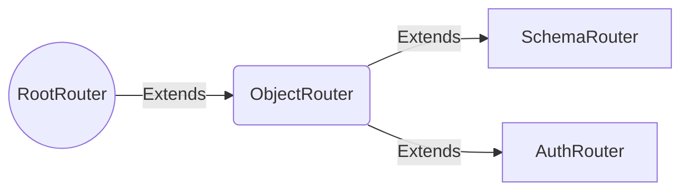
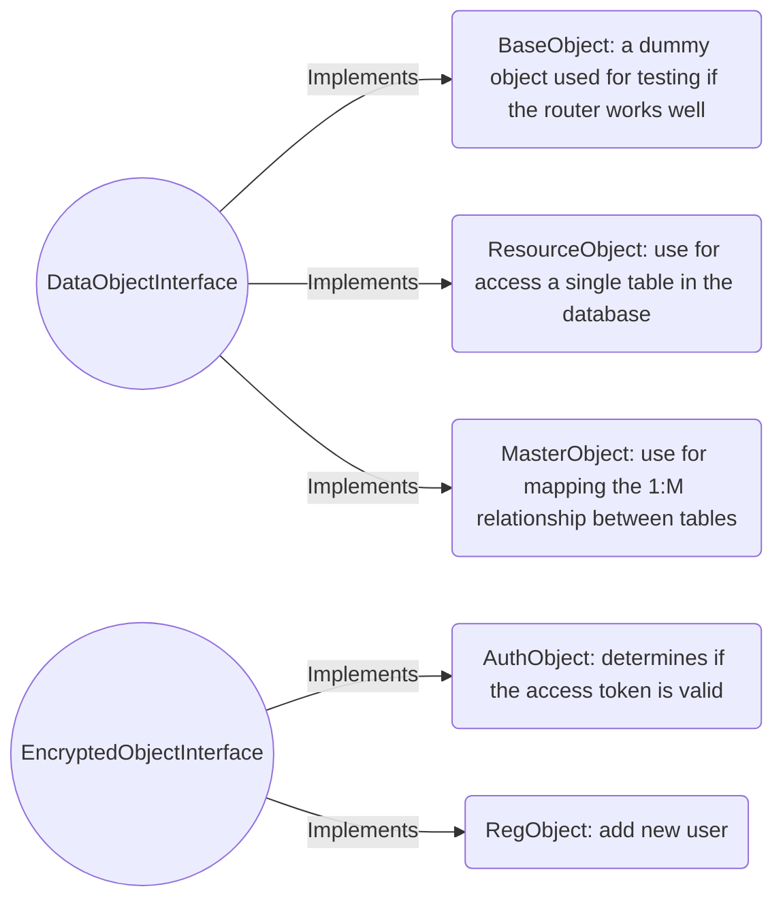

# Database
The API is built on top of **[MongoDB](https://www.mongodb.com)**, which is a NoSQL database designed for storing documents in JSON-based format. For a demonstration purpose, the community server version can be downloaded from [https://www.mongodb.com](https://www.mongodb.com) and installed on your local host. The API uses the JSON file which is located at */config/default.json* to configure the **URL** and **Schema** for database connection. This file can be customised for development, testing, or production environment.

## Connect to the database
```Javascript
const mongoose = require('mongoose')
const database = ''
const collection = ''
const engine = `${database}/${collection}`

mongoose.connect(engine, { useNewUrlParser: true, useUnifiedTopology: true, useCreateIndex: true })
.then(() => console.log('Connected to database...'))
.catch(err => console.error('Could not connect to database...',err))

module.exports = mongoose
```

# API Port
There are two APIs created within this project app.js and auth.js. The former is for accessing the database resources of customer information, while the later is built for access control. It uses [JSON Web Tokens](https://jwt.io/) to implements the security measure.

The port can be configured through the file ./config/default.json
```Javascript
{
  "development":
  {
    "node_port": 8888,
    "auth_port": 12345,
    "database": "mongodb://localhost:27017",
    "schema": "company_svn"
  }
}
```

# Environment Variable
This API uses system environment variables and must be setup before running the application\
|Environment Variable |Example                    |\
|---------------------|---------------------------|\
|NODE_ENV             |"development", "production"|\
|svn_jwtPrivateKey    |"12345"                    |\


# Router
The API handles http request from client application with [Express.js](https://www.mongodb.com). It redirects the request from different urls to the actual server resource that the client is looking for. The router within the API is a services that processes GET, POST, PUT, and DELETE requests that are sent to the following URL:\
|URL            |Description                                                              |\
|---------------|-------------------------------------------------------------------------|\
|/customer      |The RESTFul API for customer data                                        |\
|/email         |The RESTFul API for customer's email                                     |\
|/location      |The RESTFul API for customer's location                                  |\
|/customermaster|The RESTFul API for the customer with the email and location information |\
For more detail around the API router, go to [https://app.swaggerhub.com/apis-docs/COMPANY_SVN/customer/1.0.0](https://app.swaggerhub.com/apis-docs/COMPANY_SVN/customer/1.0.0)

There are multiple router classes and object classes created to for different requirements. The RootRouter provide basic function to create a express router inisde the class. ObjectRouter can take a resource object and SchemaRouter adds the schema for the resource object. AuthRouter is specificially built for authentication and registration purpose.

## Example
#### Customise the router
The API has been built resuable and extensible with easy effort to add, modify, and remove your customised routers. Under the **router** folder, there has been a Node.js module in the routerFactory.js file. By modifying this file, it can produces the user customised router for the API. Below is an example demonstrates how router object is created.
```Javascript
const express = require('express')
const app = express()

/*
To create a router, you need:
1. a pre-defined router class (SchemaRouter in this case),
2. a resource object (ResourceObject) to trigger the CRUD opration,
3. a data model to represent the database table,
4. a schema to validate the Json object pass to the router.
*/
const SchemaRouter = require('./SchemaRouter.js')
const ResourceObject = require('../resource/ResourceObject.js')
const {Customer} = require('../model/modelFactory.js')
const {customerRouterSchema} = require('../model/schema/customer.js')

/*
Create the customer router
*/
const customerRouter = new SchemaRouter(customerRouterSchema, new ResourceObject(Customer))

/*
Attach the router the the path
*/
app.use('/customers',customerRouter.getRouter())
app.listen(8888)
```
# Router helper
Router helper is a utility that handles errors and exceptions. It has several function wrappers.

## Example

#### Wrap a function with a try catch block
```Javascript
static tryCatchLog(_func)
{

  return async function()
  {
    try{
      // console.log('Function called')
      // console.log(_func.toString())
      const func = await _func.apply(this, arguments)
      return func

    }
    catch(err){
      console.error(err.message)
      return {status: 500, send: 'Internal Server Error!!!'}
    }
  }
}

setGetMethod ()
{
  this.router.get('/',
    async (req, res) => {
      const result = await this.RouterHelper.tryCatchLog
      (
        this.dataObject.getResource
      )()
      res.status(result.status).send(result.send)
    })
}
```

# Data Object
Data object is the middleman facilitating the interaction between router and the database, and introducing flexibility. It implements the CRUD operations in forms of four functions: getResource, addResource, updateResource, and deleteResource, with variations on behaviours due to different data processing logic.


## Example

#### create a router for a master object
```Javascript
const express = require('express')
const app = express()

const SchemaRouter = require('./SchemaRouter.js')

const ResourceObject = require('../resource/ResourceObject.js')
const MasterObject = require('../resource/MasterObject.js')


const {Customer, Email, Location} = require('../model/modelFactory.js')
const customerMasterRouterSchema = require('../model/schema/customerMaster.js')

/*
Create the data object customerMaster from the MasterObject class.
The class constructor specifies the customer data object as the main one.
With calling addDetailResource, it associates email and location with the customer
*/
const customerMasterObject = new MasterObject(new ResourceObject(Customer), "customer")
customerMasterObject.addDetailResource("email", new ResourceObject(Email), "customerId")
customerMasterObject.addDetailResource("location", new ResourceObject(Location), "customerId")

/*
The router is created as a SchemaRouter which takes two parameters as the input: the data object and the schema for validation
*/
const customerMasterRouter = new SchemaRouter(customerMasterRouterSchema, customerMasterObject)


app.use('/customermaster',customerMasterRouter.getRouter())
app.listen(8888)
```

# Data Model
Data model works closely with data object. In this API, it is built on top of the [Mongoose](https://mongoosejs.com/) framework which is known as the ORM tool for MongoDB. However, this is not the only option and if a SQL database is more preferred, a framework called [Sequelize](https://sequelize.org/) will be another choice.

The data model consists of two essential components - the model factory and the schema

## Example
#### Create a data model
```Javascript
const mongodb = require('../database/connection.js')
const mongoose = require('mongoose')

exports.customerDatabaseSchema = new mongoose.Schema({
  firstName: {type: String, required: true},
  lastName: {type: String, required: true},
  dateOfBirth: { type: Date, default: '1900-01-01'},
  createdBy: {type: mongoose.Schema.Types.ObjectId, required: true},
  createdDate: {type: Date, required: true},
  modifiedBy: {type: mongoose.Schema.Types.ObjectId, required: true},
  modifiedDate: {type: Date, required: true}
})

const Customer = mongodb.model('Customer', customerDatabaseSchema)
```
